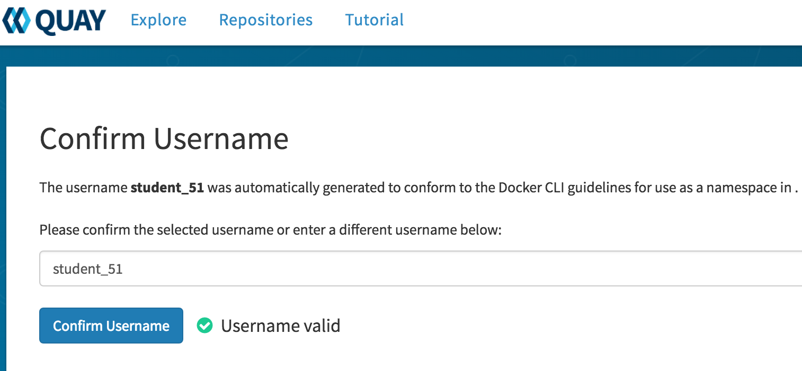

# Trusted Software Supply Chain Environment

In this lab you will explore the tools utilized throught this workshop.  

The following tools are utilized to create our Trusted Software Supply Chain.  

## Openshift

OpenShift is the container orchestration platform that hosts oure Supply Chain Tools as well as our application deployments. 

A) Navigate to the OpenShift Console: <{{ ocp_console_url }}> <a href="#0">

   * Username: `student{{ student_number }}` 
   * Password: `{{ student_pwd }}` 
 
     >Note: Click on the **Advanced** button and click on the link: **Proceed to ocpws.kee.vizuri.com (unsafe)**
    
B) You have three projects pre-created for you (*Under Home -> Projects on the left*)

* cicd-student{{ student_number }} - Tools needed for Trusted Supply Chain 
    * anchore - Container Scanning Service
    * anchoredb - Database for Anchore Container Scanning Service
    * jenkins - Jenkins
    * nexus - Nexus artifact reposigory
    * sonarqube - Code Quality Service
    * sonardb - Database for Code Quality Service
    
* dev-student{{ student_number }} - Development Project
    
* stage-student{{ student_number }} - Staging Project

> Note: Your codeready workspace will not appear until you complete the Codeready Steps Below.
    

## Jenkins

Jenkins provides the platform to execute oure Trusted Software Supply Chain CI/CD Pipelines.  

A) Confirm you can log into your jenkins console: <https://jenkins-cicd-student{{ student_number }}.{{ ocp_app_suffix }}> 

When prompted Select 'Log in with OpenShift' 

   * Username: `student{{ student_number }}` 
   * Password: `{{ student_pwd }}` 

     >Note: Click on the **Allow selected permissions** button the first time: 
      

B) Should see the message: 

## Nexus

Nexus is an artifact repository that stores versioned build artifacts.  It is utilized to store the WAR archieve in our Trusted Software Supply Chain. 

A) Confirm you can navigate to nexus: <http://nexus-cicd-student{{ student_number }}.{{ ocp_app_suffix }}> 

B) Should see the message: 

## Quay Registry 

Quay is an Enterprise Container Registry.  It is utilized to store and scan container images in our Trusted Software Supply Chain.

A) Confirm you can log into the Quay Container Registry: <https://quay.{{ ocp_app_suffix }}/repository> 

   * Username: `student{{ student_number }}` 
   * Password: `{{ student_pwd }}` 

     >Note: Click on the **Advanced** button and click on the link: **Proceed to quay.apps.ocpws.kee.vizuri.com (unsafe)**

     >Note: If asked, you may have to confirm your username. So please click on the *Confirm Username* button when prompted
    
    
     
    
## SonarQube

SonarQube is a static code analyzer that is utilized to identify issues code issues in our Trusted Software Supply Chain.

A) Confirm you can log into the sonarqube console: <http://sonarqube-cicd-student{{ student_number }}.{{ ocp_app_suffix }}> 

   * Username: `admin` 
   * Password: `admin`

   >Note: If you are prompted to enter a token just click on *Skip this tutorial* in the top right. 
   
   
    
    
B) Should see the page: 

## Gogs (git repositories) 

Gogs is a contaierized git repository.  It provides the code repository for our Trusted Software Supply Chain.

A) Confirm you can log into the gogs git server: <http://gogs.{{ ocp_app_suffix }}> 

Click the 'Sign In' Button.

   * Username: `student{{ student_number }}` 
   * Password: `{{ student_pwd }}` 

B) You have one repository that we will use for the labs:

   * openshift-tasks - Web application that is orchestrated thourgh the Trusted Software Supply Chain

  

## Codeready Workspaces 

Codeready workspaces is a container based development environemtn.  It is utilized to develop the pipelines for the Trusted Software Supply Chain.

A) Confirm you can log into Code Ready Workspaces: <http://codeready-codeready.{{ ocp_app_suffix }}> 

   * Username: `student{{ student_number }}` 
   * Password: `{{ student_pwd }}` 

     >Note: Click on the **Allow selected permissions** button the first time: 
      

     >Note: Update Account Information the first time.  You can provide any email, first name and last name you would like:
     "

 B) Should see the page: 

    

C) Create Your Workshop Workspace

Choose the 'Java Spring Boot Workshop' Template and Click on 'Create and Open' to launch your Workshop Workspace.

    

It will take a few minutes, but once your workspace has been created you should see this screen.

    

Click on the Explorer Icon in the left navigation of the workspace.

  

This will open the Explorer Window.  Verify you have the openshift-tasks project in your workspace.   This is the project you will working on to build your Trusted Software Supply Chain.

  