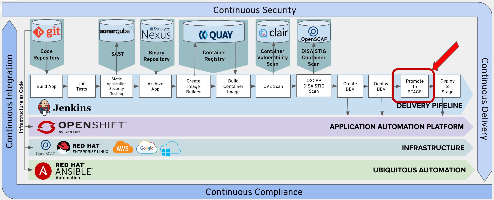
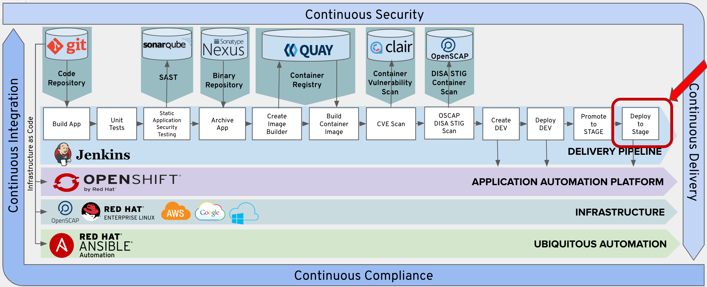
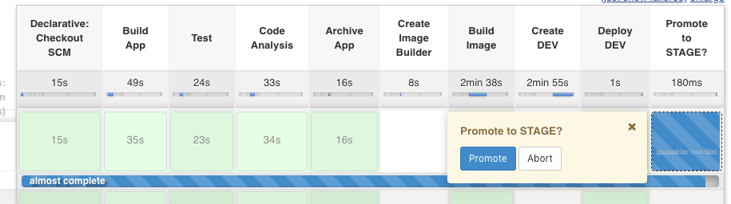
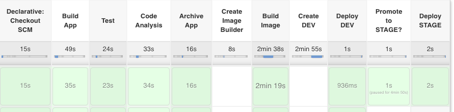

# Exercise 10 - Deploy to Stage
    
In this lab we will be confirming a deployment to staging.   Then we will deploy the task container to our stage project.  



We set an approval to promote to the application to the Stage Project. The approval process is a good feature for various gates of your deployments. We also set a 15 minute timeout on the approval. You also tag the tasks image with latest and the version from the pom file.



If the deployment config for the application already exists in the Stage Project or Environment the deployment config , service, and route are deleted. This allows for the pipeline to be rerun.

The new-app is recreated in the Stage Environment from the image that you tagged in the previous stage. The image also has a route created for with the svc.expose command.

 ## Add Promote to Stage Prompt to Pipeline

Copy the following lines and insert them into the Jenkinsfile after the 'Add Lab 10a Here' Comment.

```
    stage('Promote to STAGE?') {
      steps {
        timeout(time:15, unit:'MINUTES') {
            input message: "Promote to STAGE?", ok: "Promote"
        }

        script {
          openshift.withCluster() {
            openshift.tag("dev-student{{ student_number }}/tasks:latest", "stage-student{{ student_number }}/tasks:${version}")
          }
        }
      }
    }
```
## Add Deploy to Stage Prompt to Pipeline

Copy the following lines and insert them into the Jenkinsfile after the 'Add Lab 10b Here' Comment.

```
    stage('Deploy STAGE') {
      steps {
        script {
          openshift.withCluster() {
            openshift.withProject("stage-student{{ student_number }}") {
              if (openshift.selector('dc', 'tasks').exists()) {
                openshift.selector('dc', 'tasks').delete()
                openshift.selector('svc', 'tasks').delete()
                openshift.selector('route', 'tasks').delete()
              }

              openshift.newApp("tasks:${version}").narrow("svc").expose()
            }
          }
        }
      }
    }
```
## Commit Changes to Git

Follow the same procedure outlined in Exercise-3 to commit and push your changes to git.

## Test the Promote to Stage

From Jenkins, click the 'Build Now' option.  

 

Your pipeline will stop and wait for you to confirm the deployment to staging.  Hover over the 'Promote to STAGE' box and select 'Proceed' to trigger the deployment to staging. 

 


Verify that the Deploy STAGE step executes sucessfully.

 


## Verify Task Application is deployed to Stage Project in OpenShift

Verify that a pod had been created in your OpenShift stage project for you task application.  

Click on the following link. 

https://console-openshift-console.apps.ocpws.kee.vizuri.com/k8s/ns/stage-student{{ student_number }}/pods

You can then launch your development instance with the following URL:

http://tasks-stage-student{{ student_number }}.apps.ocpws.kee.vizuri.com
