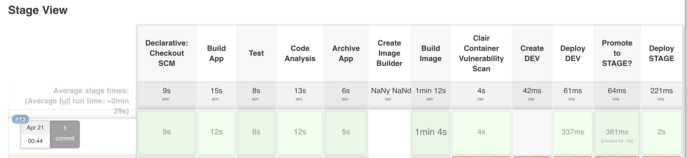
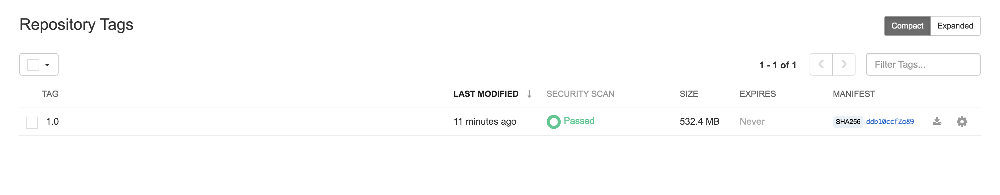

# Exercise 11- Add Clair Container Scan
Add the configuration for the Container Vulnerability Scan below to your pipeline text file.


 ## Add Promote to Stage Prompt to Pipeline

Copy the following lines and insert them into the Jenkinsfile after the 'Add Lab 10a Here' Comment.

```
    stage('Clair Container Vulnerability Scan') {
      steps {
            container("skopeo") {
                sh  '''
                  export KUBECONFIG=/tmp/kubeconfig
                  oc login -u student{{ student_number }} -p workshop1! --insecure-skip-tls-verify https://api.ocpws.kee.vizuri.com:6443 2>&1
                  skopeo --debug copy --src-creds="$(oc whoami)":"$(oc whoami -t)" --src-tls-verify=false --dest-tls-verify=false --dest-creds=student{{ student_number }}:workshop1! docker://image-registry.openshift-image-registry.svc:5000/dev-student{{ student_number }}/tasks:latest docker://quay.apps.ocpws.kee.vizuri.com/student{{ student_number }}/tasks:1.0
                '''
            }
        }
    }
```

## Commit Changes to Git

Follow the same procedure outlined in Exercise-3 to commit and push your changes to git.

## Test the Promote to Stage

From Jenkins, click the 'Build Now' option.  

 


Verify that the Deploy STAGE step executes sucessfully.

 

> Note: The stage will fail the first time you run it.  This is because the repository does not exsist in Quay yet.   Just run the job a second time and it will work.  This is just a workaround until we get a fix for this first time error. 


## View Scanning Results

Log into quay and view the resultes of your container scan.  

Click on the following link. 

https://quay.apps.ocpws.kee.vizuri.com/repository/student{{ student_number }}/tasks?tab=tags


Under the Security Scan Tab, you will see the resultes of your scan.

 

You can click on the result to see the report.