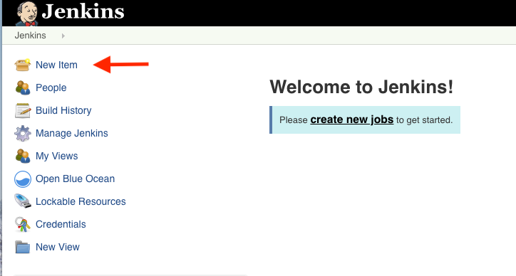
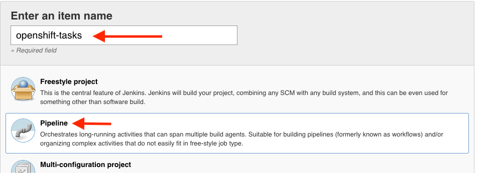
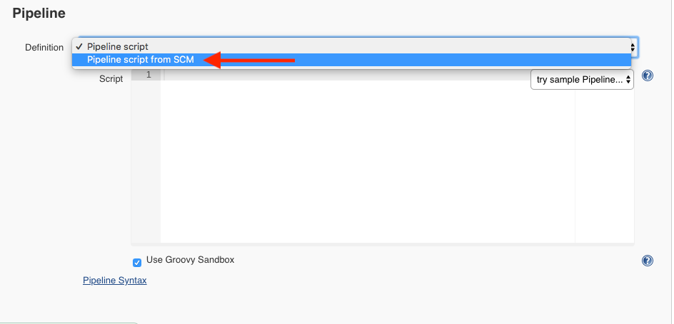
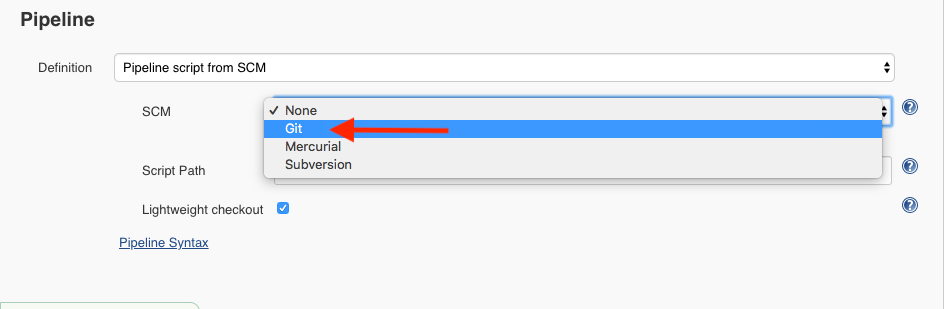
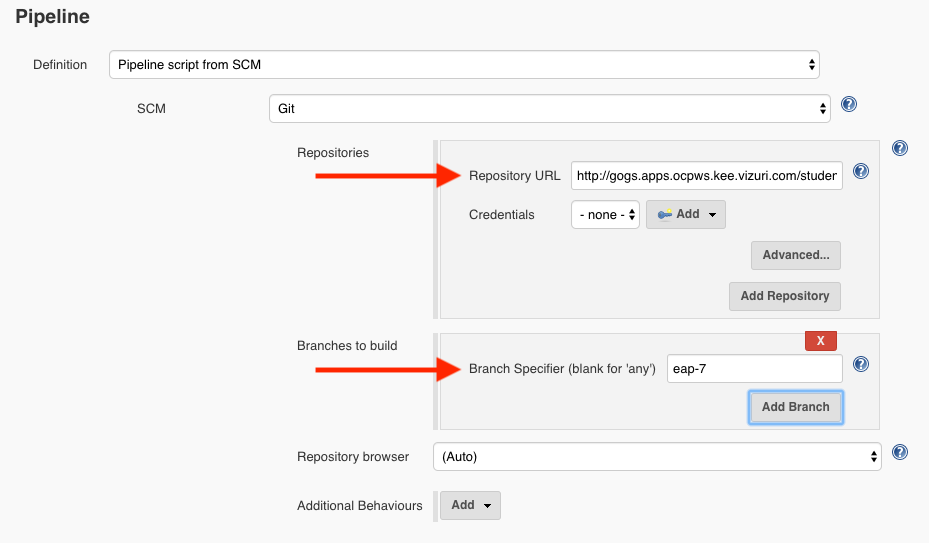
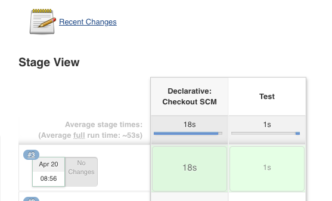

# Exercise 2 - Creating Your Pipeline

Today, you will be building your Trusted Software Supply Chain using a Jenkins Pipeline that is integrated with OpenShift.

In the Jenkins Console (<https://jenkins-cicd-student{{ student_number }}.{{ ocp_app_suffix }}> ), click on 'New Item' to create your trusted software supply chain pipeline job.

  

Enter openshift-tasks for the item name and select Pipeline as the type.

 

Click OK to create the pipeline job.  

Switch the Definition from 'Pipeline script' to 'Pipeline scipt from SCM'.  Out Pipeline Script will be stored in the git repository with the source code of the application.  

 

Choose Git from the SCM selection box.

 

Now enter your git repository URL into the Repository URL box and eap-7 into the Branch Specifier.

* Git Repository URL: http://gogs.apps.ocpws.kee.vizuri.com/student{{ student_number }}/openshift-tasks.git
* Branch Specifier: eap-7

 

Click 'Save' to create your pipeline job.

Click on 'Build Now' in the left menue of your job to test that your pipeline job is configured properly.  

 

Verify your pipeline completes successfully in the Stage View.

 

You will be adding to this pipleine in the rest of the labs.