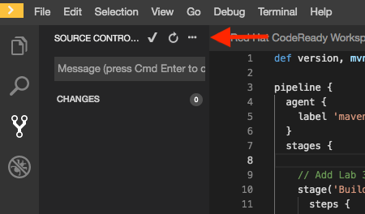

# Exercise 3 - Build App Stage

In this lab, you will add the Build App stage to your pipeline.  


The Jenkins Pipeline for our Trusted Software Supply Chain is stared in the git repository along side our application code.

## Open Pipeline Jenkinsfile

In your codeready workshpace (<http://codeready-codeready.{{ ocp_app_suffix }}>), double click on the Jeninsfile in the left explorer window.  This will open the Jenkinsfile in the editor window.


This is the file you will be using to build your Trusted Software Supply Chain.


## Remove Test State

Remove the following lines from the provided Jenkinsfile.

```
    // Remove This Stage in Lab 3 
    stage("Test") {
        steps {
            sh "echo 'testing 123'"
        }
    }
    // End Remove
```
## Add App Build Stage

Copy the following lines and insert them into the Jenkinsfile after the 'Add Lab 3 Here' Comment.

```
    stage('Build App') {
      steps {
        git branch: 'eap-7', url: 'http://gogs.apps.ocpws.kee.vizuri.com/student{{ student_number }}/openshift-tasks.git'
        script {
            def pom = readMavenPom file: 'pom.xml'
            version = pom.version
        }
        sh "${mvnCmd} install -DskipTests=true"
      }
    }
```

The Build App Stage checks the code out of your gogs repo and  performs a maven install command to create the war archive for the applcation. 

Maven install will run through the Maven lifecycle and skip the tests. We will execute tests later in the pipeline.

The foloowing are the maven lifecycle phases.  

* validate - validate the project is correct and all necessary information is available
* compile - compile the source code of the project
* test - test the compiled source code using a suitable unit testing framework. These tests should not require the code be packaged or deployed
* package - take the compiled code and package it in its distributable format, such as a JAR.
* verify - run any checks on results of integration tests to ensure quality criteria are met
* install - install the package into the local repository, for use as a dependency in other projects locally
* deploy - done in the build environment, copies the final package to the remote repository for sharing with other developers and projects.

## Commit Changes to Git

You need to push your Pipeline changes to your git repository before testing the Build App stage.

Click the Source Control Icon in the left navigation window. 


This will open Source Code Control window.  

You will see that you have changes to your Jenkinsfile.

Enter a Comment 'Exercise3' Into the comment box and click the check mark in the top of the window to commit your changes. 


Now click on the three dots (...) next the check mark to pull down more source control options.



Choose the push option to push your changes to your git repository. 


You may see the following popup.  If so, just choose 'No'.  


## Test the Build App Stage

From Jenkins, click the 'Build Now' option.  

 

Verfiy that the Build App stage executes sucessfully.

 
<br/><br/>

> Note:  If you need to modify you Jenkins file, make sure you follow the Commit Changes to Git steps to commit and push the changes to your git repository before re-running your Jenkins Pipeline.  
