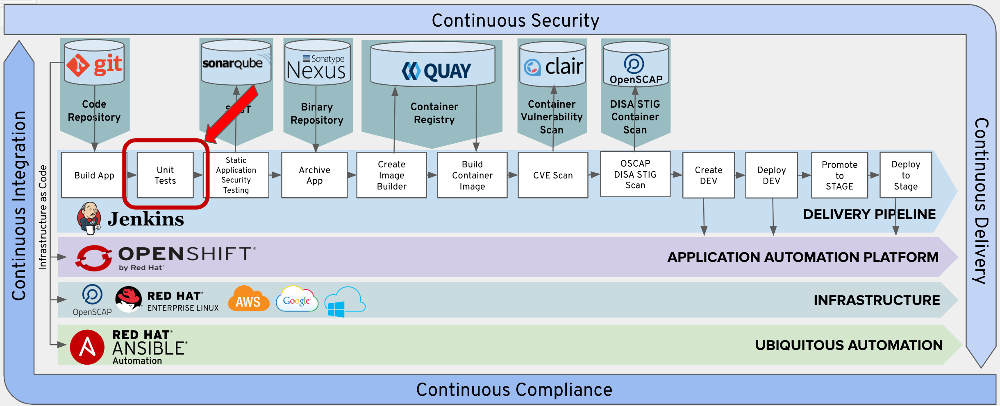
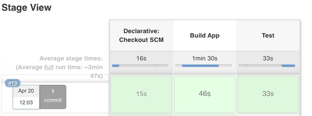

# Exercise 4 - Test Stage

In this Lab, you will add the Test Stage to you Pipeline.  



## Add Test Stage To Pipeline

Copy the following lines and insert them into the Jenkinsfile after the 'Add Lab 4 Here' Comment.

```
    stage('Test') {
      steps {
        sh "${mvnCmd} test"
        step([$class: 'JUnitResultArchiver', testResults: '**/target/surefire-reports/TEST-*.xml'])
      }
    }
```
Maven will run the test stage in the life cycle that we skipped at the previous stages.

Maven will place the test results in the surefire-reports folder. The maven surefire-reports plugin allows for the generation of reports for your unit tests.

## Commit Changes to Git

Follow the same procedure outlined in Exercise-3 to commit and push your changes to git.

## Test the Test Stage

From Jenkins, click the 'Build Now' option.  

 

Verfiy that the Test stage executes sucessfully.

 