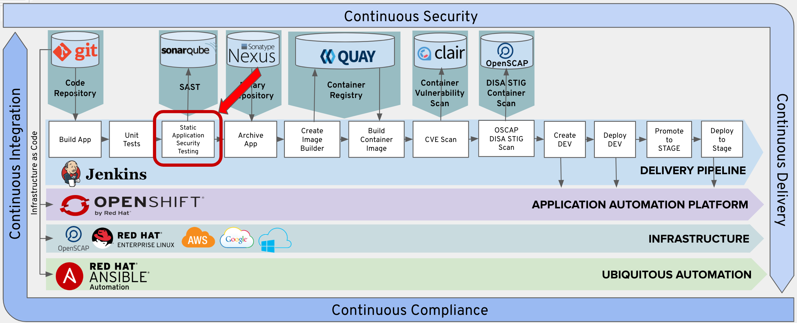
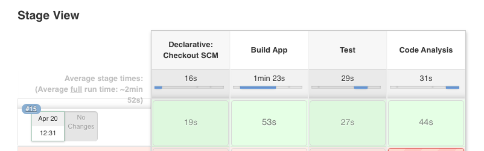

# Exercise 5: Static Application Security Testing

In this lab, you will be adding a static code analysis stage to you pipeline.



We will leverage the Maven Sonar plugin to run SonarQube scanning against our source code.

SonarQube is an open source static code analysis tool that we can use to automate running security scans against your source code to further improve the security of your application. Every time you check-in code, SonarQube will scan the quality and perform a threat analysis of that code.

We leverage the sonarqube maven plugin and specify the maven goal "sonar:sonar" to run our project leveraging the sonarqube api.

SonarQube's security rules originate from these standards:

[CWE Database](http://cwe.mitre.org/about/index.html) - Common Weakness Enumeration (CWE™) is a formal list or dictionary of common software weaknesses that can occur in software's architecture, design, code or implementation that can lead to exploitable security vulnerabilities.

[SANS Top 25](https://www.sans.org/top25-software-errors/) - The SANS Top 25 list is a collection of the 25-most dangerous errors listed in the CWE, as compiled by the SANS organization.

[OWASP Top 10](https://www.owasp.org/index.php/Top_10-2017_Top_10) - The OWASP Top 10 is a list of broad categories of weaknesses, each of which can map to many individual rules.


## Add Code Analysis Stage To Pipeline

Copy the following lines and insert them into the Jenkinsfile after the 'Add Lab 5 Here' Comment.

```
    stage('Code Analysis') {
      steps {
        script {
          sh "${mvnCmd} sonar:sonar -Dsonar.host.url=http://sonarqube:9000 -DskipTests=true"
        }
      }
    }
```
## Commit Changes to Git

Follow the same procedure outlined in Exercise-3 to commit and push your changes to git.

## Test the Code Analysis Stage

From Jenkins, click the 'Build Now' option.  

 

Verfiy that the Code Analysis stage executes sucessfully.

 

## View Code Analysis Report

You can view your code anlysis report here.

http://sonarqube-cicd-student{{ student_number }}.apps.ocpws.kee.vizuri.com/dashboard?id=org.jboss.quickstarts.eap%3Ajboss-tasks-rs