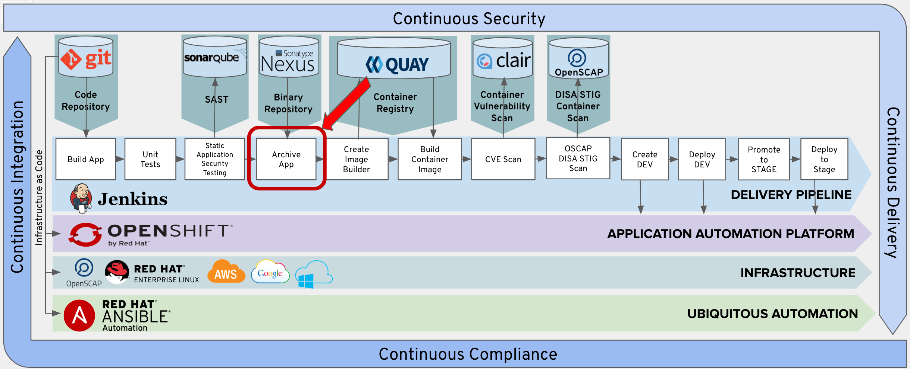
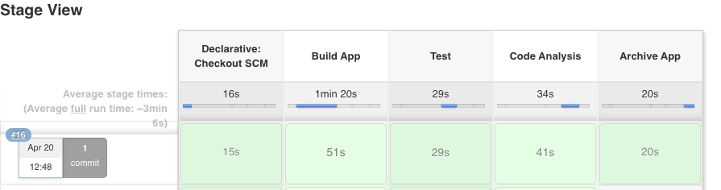

# Exercise 6 - Add Archive Stage
Archiving the built and tested application into a trusted repository is important to making sure you are building with trusted parts. You assume this application is built properly and all the previous stages have passed. With that confidence, your built and tested application should be immutable in a trusted repository. The repository will version or audit any changes to the application, configuration, and dependencies.




## Add Archive Stage To Pipeline

Copy the following lines and insert them into the Jenkinsfile after the 'Add Lab 6 Here' Comment.

```
    stage('Archive App') {
      steps {
        sh "${mvnCmd} deploy -DskipTests=true -P nexus3"
      }
    }
```

We leveraged the maven nexus plugin for this deployment. The mvn deploy step is the last step in the maven lifecycle. The built application is archived into the nexus repository. We can see it later once we run the pipeline.

The "-P nexus3" option activates the nexus3 profile defined in the configuration/cicd-settings-nexus3.xml
## Commit Changes to Git

Follow the same procedure outlined in Exercise-3 to commit and push your changes to git.

## Test the Archive App Stage

From Jenkins, click the 'Build Now' option.  

 

Verfiy that the Archive App stage executes sucessfully.

 

## Verify Archive in Nexus

You can view your nexus archive here.

http://nexus-cicd-student{{ student_number }}.apps.ocpws.kee.vizuri.com/#browse/browse:maven-snapshots:org%2Fjboss%2Fquickstarts%2Feap%2Fjboss-tasks-rs%2F7.0.0-SNAPSHOT