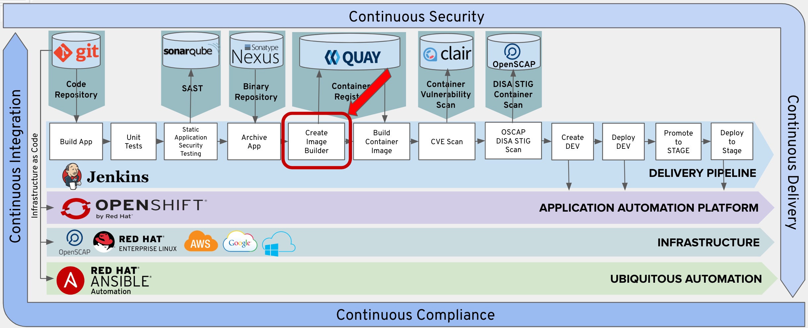
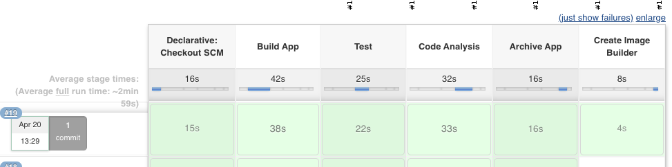

# Exercise 7 - Add Create Image Builder Stage

Next we will add the Create Image Builder Stage into your pipeline.




## Add Create Image Builder Pipeline

Copy the following lines and insert them into the Jenkinsfile after the 'Add Lab 7 Here' Comment.

```
    stage('Create Image Builder') {
      when {
        expression {
          openshift.withCluster() {
            openshift.withProject("dev-student{{ student_number }}") {
              return !openshift.selector("bc", "tasks").exists();
            }
          }
        }
      }
      steps {
        script {
          openshift.withCluster() {
            openshift.withProject("dev-student{{ student_number }}") {
              openshift.newBuild("--name=tasks", "--image-stream=jboss-eap72-openshift:1.1", "--binary=true")
            }
          }
        }
      }
    }
```
This step will create a new build. We will be leveraging a trusted JBoss EAP 7 container.

The golden image will will be using for our applications is jboss-eap70-openshift:1.5. Again, you'll want a hardened, secured, patched and up to date container image as a foundation for your application.


## Commit Changes to Git

Follow the same procedure outlined in Exercise-3 to commit and push your changes to git.

## Test the Create Image Builder Stage

From Jenkins, click the 'Build Now' option.  

 

Verfiy that the Create Image Builder stage executes sucessfully.

 

## Verify Build Config Created In OpenShift

This step creates an image buildder BuildConfig in OpenShift.  Click on the link below to verify that the BuildConfig has been created.

https://console-openshift-console.apps.ocpws.kee.vizuri.com/k8s/ns/dev-student{{ student_number }}/buildconfigs

There should be a build config created named tasks.
In the next lab, you will add a stage to trigger the execution of this build config to create your container image.  


