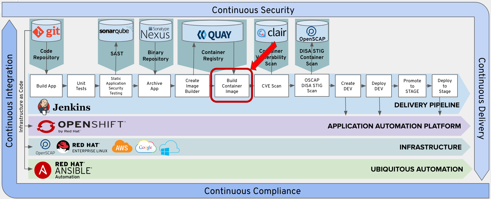
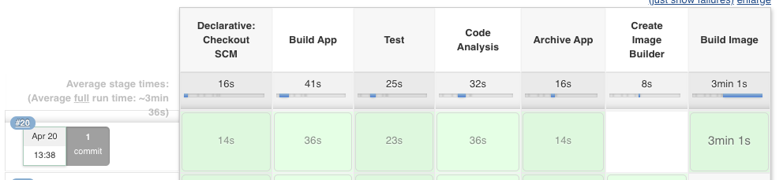
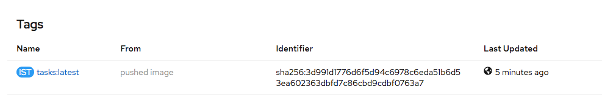

# Exercise 8: Add Build Image Stage
Add the Build Image Stage into your pipeline.




 ## Add Build Image Stage to Pipeline

Copy the following lines and insert them into the Jenkinsfile after the 'Add Lab 8 Here' Comment.

```
    stage('Build Image') {
      steps {
        sh "rm -rf oc-build && mkdir -p oc-build/deployments"
        sh "cp target/openshift-tasks.war oc-build/deployments/ROOT.war"

        script {
          openshift.withCluster() {
            openshift.withProject("dev-student{{ student_number }}") {
              openshift.selector("bc", "tasks").startBuild("--from-dir=oc-build", "--wait=true")
            }
          }
        }
      }
    }
```
The "sh" are shell commands in your pipeline that are executed on the Jenkins Slave. Maven built the openshift-tasks.war in it the target directory and it will be copied into the created oc-builds directory.

The startBuild stage is kicked off from Openshift and pointing to the local directory "oc-build" on the Jenkins slave.


## Commit Changes to Git

Follow the same procedure outlined in Exercise-3 to commit and push your changes to git.

## Test the Build Image Stage

From Jenkins, click the 'Build Now' option.  

 

Verfiy that the Build Image stage executes sucessfully.

 

>Note: You may notice that the Create Image Builder is skipped.  This is because the creation of the BuidConig in OpenShift only runs once.  This is due to the when condition surounding the stage.

## Verify Image Created In OpenShift

This step creates executes the Image Builder BuildConfig and pushes the image to an Image Stream in your dev project.  

Verify that image has been pushed to you image steam in OpenSHift.

Click on the following link. 

https://console-openshift-console.apps.ocpws.kee.vizuri.com/k8s/ns/dev-student{{ student_number }}/imagestreams/tasks

Scroll to the bottom of the page and verify you have a tasks:latest tag under the tags section.


 
