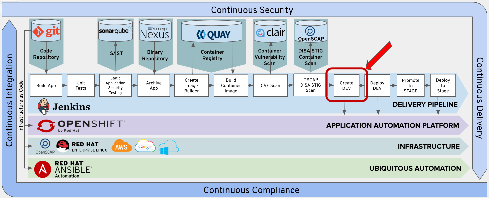
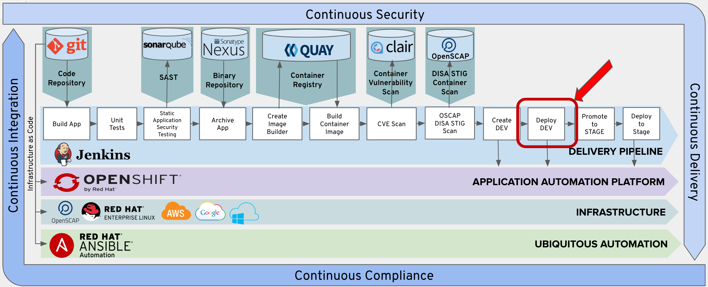
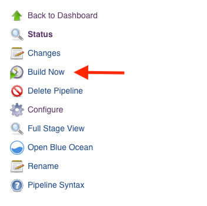
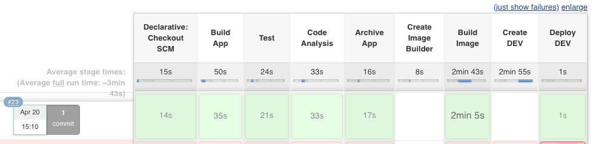

# Exercise 9 - Create and Deploy To Dev
    
In this lab web will be creating an OpenShift Deployment Config that can be executed to deploy our container image into our DEV project.  



Then we are going to trigger the execution of that deployment config.  



## Add Create DEV Stage to Pipeline

Copy the following lines and insert them into the Jenkinsfile after the 'Add Lab 9a Here' Comment.

```
    stage('Create DEV') {
      when {
        expression {
          openshift.withCluster() {
            openshift.withProject("dev-student{{ student_number }}") {
              return !openshift.selector('dc', 'tasks').exists()
            }
          }
        }
      }
      steps {
        script {
          openshift.withCluster() {
            openshift.withProject("dev-student{{ student_number }}") {
              def app = openshift.newApp("tasks:latest")
              app.narrow("svc").expose();

              def dc = openshift.selector("dc", "tasks")
              while (dc.object().spec.replicas != dc.object().status.availableReplicas) {
                  sleep 10
              }
              openshift.set("triggers", "dc/tasks", "--manual")
            }
          }
        }
      }
    }
```
We first check if an deployment config for the Dev Project already exists. If it does not exists, a new application is created and deployment config is defined for the Dev Project.


## Add Deploy DEV Stage to Pipeline

Copy the following lines and insert them into the Jenkinsfile after the 'Add Lab 9b Here' Comment.

```
    stage('Deploy DEV') {
      steps {
        script {
          openshift.withCluster() {
            openshift.withProject("dev-student{{ student_number }}") {
              openshift.selector("dc", "tasks").rollout().latest();
            }
          }
        }
      }
    }
```

## Commit Changes to Git

Follow the same procedure outlined in Exercise-3 to commit and push your changes to git.

## Test the Create and Deploy DEV Stages

From Jenkins, click the 'Build Now' option.  

 

Verfiy that the Create and Deploy DEV stages execute sucessfully.

 

>Note: if you execute more than once the Create DEV step may be skipped because it already exists.


## Verify Task Application is deployed to DEV Project in OpenShift

Verify that a pod had been created in your OpenShift dev project for you task application.  

Click on the following link. 

https://console-openshift-console.apps.ocpws.kee.vizuri.com/k8s/ns/dev-student{{ student_number }}/pods

You can then launch your development instance with the following URL:

http://tasks-dev-student{{ student_number }}.apps.ocpws.kee.vizuri.com
